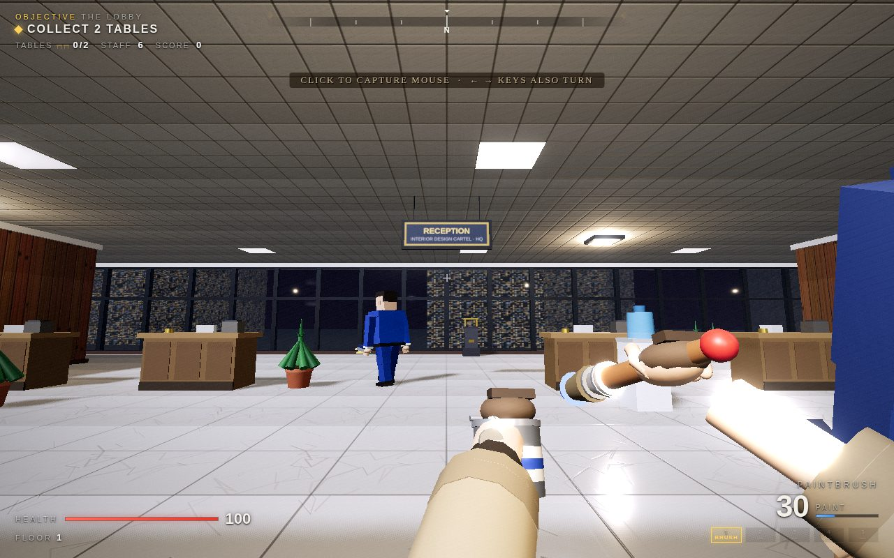
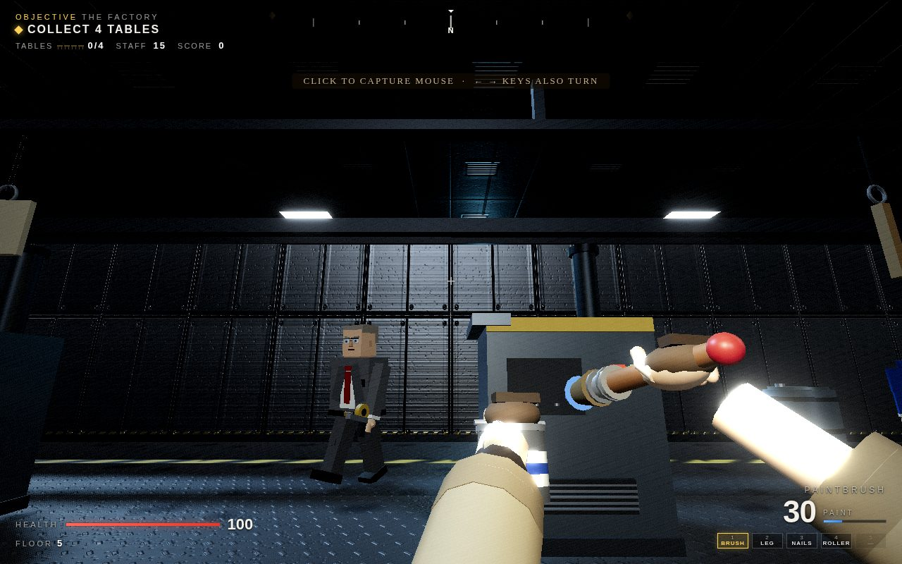

<h1 align="center">Sandy's Table Quest 3D</h1>

<p align="center">
  
</p>

<p align="center">
  <strong>A furniture-blasting retro FPS about reclaiming six floors of stolen masterpieces from the armed Interior Design Cartel.</strong>
</p>

<p align="center">
  <a href="#download--play"><strong>Download &amp; Play</strong></a>
  &nbsp;&bull;&nbsp;
  <a href="#gameplay"><strong>Gameplay</strong></a>
  &nbsp;&bull;&nbsp;
  <a href="#build-from-source"><strong>Build from Source</strong></a>
</p>

<p align="center">
  
  
  
</p>

> **They took the tables. She's taking them back.**


**Sandy's Table Quest 3D** is a ground-up WebGL remaster of the Artisan Software raycaster *Sandy's Table Quest*. Play as Sandy, an artisan furniture maker with a paint-loaded arsenal and six floors of armed middle-management standing between her and her stolen masterpiece tables.

The original boot screens, title art, box art, story, and gloriously strange premise are preserved. Everything around them has been rebuilt as a true 3D game with dynamic lighting, physical movement, destructible furniture, animated enemies, and a fully procedural soundtrack.

| At a glance | |
|:--|:--|
| **Mission** | Recover every table, unlock the elevator, and climb the Cartel HQ |
| **Campaign** | Six distinct floors culminating in a two-phase boss fight |
| **Arsenal** | Five weapons, from Sandy's paintbrush to an industrial paint sprayer |
| **Enemies** | Guards, Managers, Executives, and the Head Designer |
| **Delivery** | One self-contained HTML file; no installation required to play |

## Gameplay

Every floor is a compact combat-and-exploration mission:

1. **Infiltrate the floor.** Explore offices, vaults, showrooms, assembly lines, and suspiciously hostile break rooms.
2. **Recover Sandy's tables.** Find every stolen masterpiece to release the elevator lock.
3. **Fight the staff.** Cartel employees alert one another, strafe, lead shots, and open doors while hunting you.
4. **Smash the furniture.** Destructible props burst into splinters and sometimes conceal cash.
5. **Ride upward.** Survive all six floors and settle the matter with the Head Designer.

Movement is fast and physical: smooth collision sliding, sprinting, jumping, head-bob, strafe banking, weapon sway, recoil, and full mouse look. Combat adds hit markers, muzzle-flash lighting, paint decals, particles, screen shake, and a short mercy window when each floor begins.

### Why it hits differently

- **Corporate dungeon crawling** through six purpose-built floors rather than repeated procedural corridors
- **Furniture destruction** with wood splinters, hidden cash, and deeply personal consequences
- **Pack-aware enemies** that communicate, reposition, breach doors, and pressure without firing in perfect unison
- **Five tactile weapons** with distinct roles, viewmodels, recoil, sound, and impact effects
- **A carved-workbench HUD** with brass plaques, Sandy's portrait, a pegboard arsenal, and a blueprint minimap
- **Nine procedural songs** synthesized in real time alongside roughly 25 generated sound effects

## Six Floors of Cartel HQ

<table>
  <tr>
    <td width="50%"></td>
    <td width="50%"></td>
  </tr>
  <tr>
    <td align="center"><strong>The Archives</strong><br />Where they bury the warranty claims.</td>
    <td align="center"><strong>The Factory</strong><br />Where masterpieces become particle board.</td>
  </tr>
</table>

| Floor | Operation | What waits inside |
|:--:|:--|:--|
| **1** | **The Lobby** | Marble halls, reception desks, first contact, and two stolen tables |
| **2** | **The Office** | Cubicle farms, break rooms, conference spaces, and increasingly organized staff |
| **3** | **The Archives** | Record vaults, shelf stacks, reading rooms, and a misfiled Nail Gun |
| **4** | **The Showroom** | Staged living rooms, flat-pack aisles, checkout lanes, and a Roller Launcher |
| **5** | **The Factory** | Assembly machines, paint stock, lumber yards, and the industrial Paint Sprayer |
| **6** | **The Penthouse** | Trophy galleries, an executive arena, and one very angry Head Designer |

## Sandy's Arsenal

| Slot | Weapon | Role |
|:--:|:--|:--|
| `1` | **Paintbrush** | Reliable starting weapon with unlimited courage and limited paint |
| `2` | **Table Leg** | Hidden melee weapon; no ammunition and no respect for personal space |
| `3` | **Nail Gun** | Fast, precise pneumatic fire for stapling blazers shut |
| `4` | **Roller Launcher** | Heavy splash damage for giving entire rooms a fresh coat |
| `5` | **Paint Sprayer** | Full-auto industrial paint delivery for the late-game crowd |

Weapons are discovered as you climb, persist between floors, and can be selected directly with `1`-`5` or cycled with `Q` and the mouse wheel.

### Field supplies

- **Tables** are the objective. Collect every one on the floor to unlock the elevator.
- **Blue paint buckets** restore 14 paint.
- **Fritos bags** restore 25 health, sprite-for-sprite and crunch-for-crunch from the original.
- **Cash and gold bars** increase score; destructive interior inspection is encouraged.
- **Weapon pickups** permanently expand Sandy's arsenal for the current run.

## The Cartel

| Enemy | Threat | Behavior |
|:--|:--:|:--|
| **Guard** | Low | Numerous blue-suited staff who rely on volume rather than aim |
| **Manager** | Medium | Gray suits, glasses, better movement, and some predictive shooting |
| **Executive** | High | Fast black-suited hunters with strong shot leading |
| **Head Designer** | Boss | A two-phase fight with rage volleys, supply drops, and a cover-filled arena |

Staff alert nearby allies when they spot Sandy, strafe during firefights, and carry enough authority to open doors while pursuing her. Their shots are deliberately staggered: the result is pressure and crossfire rather than an instant firing squad.


## Download & Play

The pre-built game is a single self-contained HTML file.

> **Preview build: Sandy's Table Quest MODERN.** A work-in-progress fork that re-presents the same game in a mid-2000s shooter style (lit and shadowed rooms, modern HUD, cinematic front-end, re-orchestrated score) while keeping every floor, weapon, enemy, and line of story identical. It lives in [`modern/`](modern/) and builds to `dist/modern/index.html`. The plan and progress log are in [`docs/modern/GOAL_LOOP.md`](docs/modern/GOAL_LOOP.md) and [`modern/PROGRESS.md`](modern/PROGRESS.md). The classic build below is unchanged.

| Lobby | Office | Factory | Penthouse |
|:-:|:-:|:-:|:-:|
|  |  |  |  |

Polish round 2 (workbench menu and crawl restored, bench HUD with Sandy's portrait, new hands and tools, controls pass) is logged in [`docs/modern/GOAL_LOOP_2.md`](docs/modern/GOAL_LOOP_2.md) with sheets under `modern/docs/R*`. Every screen and floor side by side with the classic: [`modern/docs/comparison.md`](modern/docs/comparison.md). Design notes: [`docs/modern/design.md`](docs/modern/design.md). Score previews: [`modern/docs/M6/`](modern/docs/M6/).


1. [Download the repository as a ZIP](https://github.com/chrissotraidis/tablequestIII/archive/refs/heads/main.zip) and extract it.
2. Open `dist/index.html` in Chrome, Firefox, Safari, or Edge.
3. Reclaim the tables.

No server, installer, account, or internet connection is required after download.

### Build from source

Use Node.js `20.19+` on the Node 20 line, or Node.js `22.12+`.

```bash
git clone https://github.com/chrissotraidis/tablequestIII.git
cd tablequestIII
npm ci
npm run dev
```

The development server opens at `http://localhost:5173` by default.

To produce the distributable single-file build:

```bash
npm run build
```

Vite writes the complete game to `dist/index.html`.

To run or build the modern preview instead:

```bash
npm run dev:modern
```

```bash
npm run build:modern
```

`npm run build:all` builds both; the modern preview lands in `dist/modern/index.html`.

## Controls

| Input | Action |
|:--|:--|
| `W` `A` `S` `D` | Move and strafe |
| Mouse | Look; click the game to capture the pointer |
| `Left` `Right` | Turn without mouse capture |
| Left click / `Ctrl` | Fire; hold for automatic weapons |
| `Space` | Jump |
| `Shift` | Sprint |
| `E` | Open an adjacent door |
| `1`-`5` | Select weapon |
| `Q` / Mouse wheel | Cycle weapons |
| `[` `]` | Adjust saved mouse sensitivity |
| `Tab` | Toggle the blueprint minimap |
| `U` | Mute or unmute |
| `Esc` | Pause; focus loss also pauses automatically |

## From 199X to WebGL

<p align="center">
  
</p>

The remaster keeps the original game's identity while rebuilding its mechanics and presentation around a real-time 3D engine.

| | Original 1.0 | 3D Remaster 2.x |
|:--|:--|:--|
| **Renderer** | 320x200 CPU raycaster | three.js, real geometry, fog, dynamic lights, and ACES tone mapping |
| **Campaign** | Four levels | Six location-designed floors with bespoke rooms and destructible props |
| **Enemies** | Billboard sprites | Animated 3D models with pack AI, strafing, shot leading, and door breaching |
| **Weapons** | Paintbrush and table leg | Five weapons with Sandy's arms, sway, recoil, muzzle flashes, and splash damage |
| **Movement** | Grid shuffle | Smooth circle collision, sprinting, jumping, head-bob, and strafe banking |
| **Doors** | Cells that disappear | Animated sliding doors and sinking elevator gates |
| **Effects** | Minimal | Paint splats, particles, wood debris, screen shake, hit markers, and blob shadows |
| **Audio** | Four synth songs | Nine 16-bar compositions with stereo staging, swing, fills, and expanded SFX |
| **Finale** | Stat-heavy encounter | A two-phase boss fight with rage volleys, supplies, and arena cover |

## Under the Hood

The game is intentionally small to distribute, not small in scope:

- **three.js renderer** with merged world geometry, per-floor fog and lighting palettes, and one draw call per material
- **ASCII-authored levels** compiled at runtime into walls, doors, gates, props, encounter spaces, and pickups
- **Code-generated models and textures** with the original 199X artwork preserved as the only hand-authored runtime visual assets
- **Web Audio synth engine** with subtractive synthesis, envelopes, LFOs, convolution reverb, feedback delay, and look-ahead sequencing
- **Single-file Vite build** that inlines the game code and original artwork into one zero-dependency HTML document

<details>
<summary><strong>Project architecture</strong></summary>

```text
tablequestIII/
|-- README.md
|-- index.html              # UI shell, screens, HUD, and menus
|-- vite.config.js          # Single-file build configuration
|-- dist/
|   `-- index.html          # Complete playable game
|-- docs/readme/            # Gameplay screenshots used in this README
|-- src/
|   |-- main.js             # Boot sequence, menus, state machine, render loop
|   |-- game.js             # Player, combat, enemies, pickups, progression
|   |-- world.js            # ASCII map to merged 3D geometry, doors, lighting
|   |-- levels.js           # Six floor definitions, zones, and themes
|   |-- models.js           # Procedural enemies, props, and viewmodels
|   |-- textures.js         # Procedural canvas materials
|   |-- audio.js            # Synth engine, sequencer, songs, and SFX
|   |-- effects.js          # Particles and paint decals
|   |-- hud.js              # HUD, Sandy portrait, and minimap
|   |-- input.js            # Keyboard, mouse, and pointer lock
|   `-- config.js           # Gameplay tuning
`-- tools/
    `-- validate_levels.js  # Map enclosure and reachability validator
```

</details>

<details>
<summary><strong>Playtest harness</strong></summary>

The browser console exposes `TQ`, a focused testing API with floor warps, teleportation, god mode, state snapshots, and simulation-driven autopilot through `TQ.botGoto` and `TQ.botFight`.

Every floor has been cleared end-to-end with automated walkthroughs. The boss fight is certified winnable at the intended die-once, learn, win-the-retry difficulty.

</details>

## The Story

In the year 199X, the Interior Design Cartel declared war on durability. Craftsmanship was replaced by fast furniture: flimsy, soulless, and impossible to repair.

Sandy refused to fold. Her tables were built to survive generations, hostile takeovers, and possibly a nuclear winter. So the Cartel raided her workshop, stole every masterpiece, and made one fatal mistake.

They left her alive.

Tonight, Sandy enters their headquarters armed with a paint-flinging brush and a professional objection to particle board.

**Recover the tables. Splatter the critics. Remind them what solid wood feels like.**

## Credits

- **Original game, concept, story, and artwork:** *Sandy's Table Quest* by Artisan Software, 199X
- **3D remaster engine:** [three.js](https://threejs.org/)
- **Music and sound effects:** Generated in real time with the Web Audio API
- **Inspiration:** *Wolfenstein 3D*, *DOOM*, and the golden age of 1990s shooters

## License

Released under the [MIT License](LICENSE).

<p align="center">
  <strong>Fight the Cartel. Recover the tables. Defeat the Head Designer.</strong>
</p>
