<h1 align="center">Sandy's Table Quest</h1>

<p align="center">
  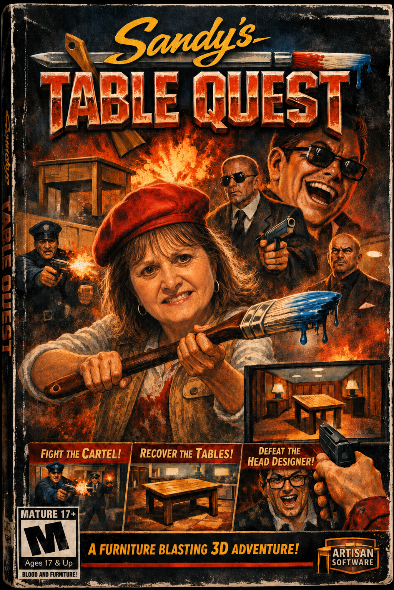
</p>

<p align="center">
  <strong>A furniture-blasting first-person shooter about reclaiming six floors of stolen masterpieces from the armed Interior Design Cartel.</strong>
</p>

<p align="center">
  <a href="#play"><strong>Play</strong></a>
  &nbsp;&bull;&nbsp;
  <a href="#four-generations-one-file"><strong>Four generations</strong></a>
  &nbsp;&bull;&nbsp;
  <a href="#the-game"><strong>The game</strong></a>
  &nbsp;&bull;&nbsp;
  <a href="#build-from-source"><strong>Build</strong></a>
  &nbsp;&bull;&nbsp;
  <a href="#documentation"><strong>Documentation</strong></a>
</p>

<p align="center">
  
  
  
  
</p>

> **They took the tables. She's taking them back.**

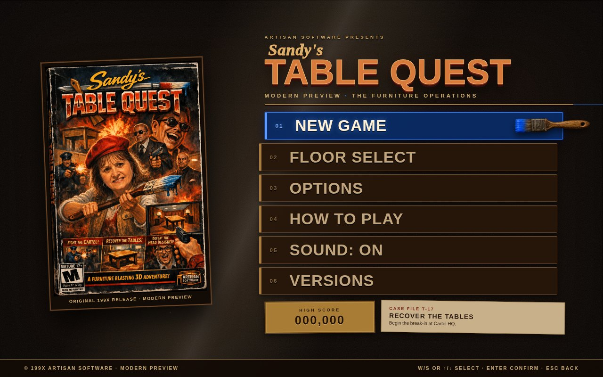

**Sandy's Table Quest** started life as a 320×200 browser raycaster from Artisan Software. This repository holds every
generation the game has been through since, and ships them together in **one downloadable package**: the current
**MODERN** build (generation 3), the classic 3D remaster (2.1), the very first WebGL build (2.0), and the story of the
199X original (1). Pick **Versions** on the main menu and click between them.

The premise never changed. Sandy is an artisan furniture maker. The Cartel raided her workshop, seized her tables, and
left her alive. Tonight she walks into their headquarters with a paint-loaded brush and a professional objection to
particle board.

| At a glance | |
|:--|:--|
| **Mission** | Recover every table on a floor to unlock the elevator, then climb |
| **Campaign** | Six hand-built floors of Cartel HQ, ending in a two-phase boss fight with the Head Designer |
| **Arsenal** | Paintbrush, table leg, nail gun, roller launcher, paint sprayer |
| **Enemies** | Guards, Managers, Executives, and the Head Designer, with pack AI that flanks, leads shots and breaches doors |
| **Presentation** | Lit and shadowed rooms, post-processing, a carved-workbench HUD with Sandy's reacting portrait, nine procedural songs |
| **Delivery** | Four self-contained HTML builds in one package; no installer or network |

## Play

1. [Download the repository as a ZIP](https://github.com/chrissotraidis/tablequestIII/archive/refs/heads/main.zip) and extract it.
2. Open **`dist/index.html`** in Chrome, Firefox, Safari or Edge.
3. Press a key or click through the memory screen and title card, pick **New Game**, and reclaim the tables.

Click the game once to capture the mouse. `Esc` pauses. Everything else is on the **How to Play** screen and in
[Controls](#controls) below.

## Four generations, one package

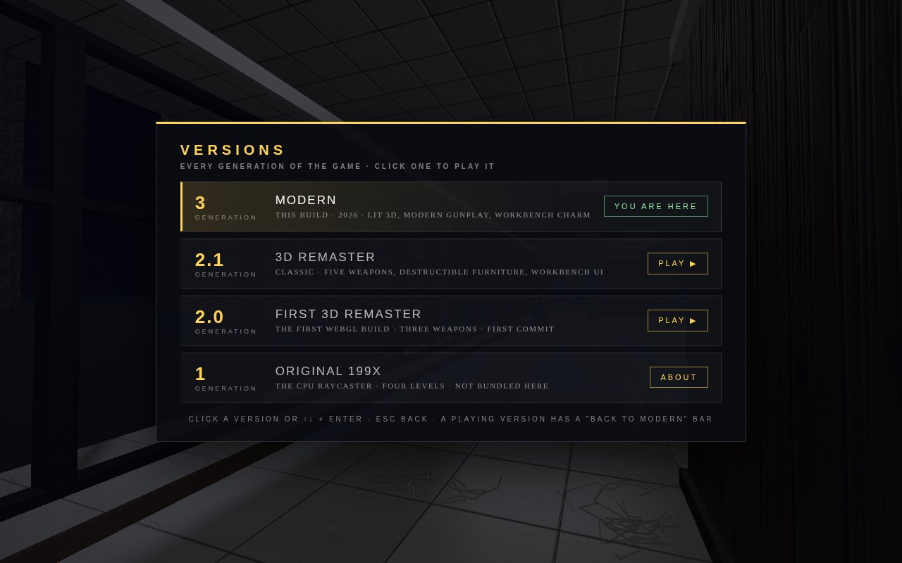

The game has been rebuilt three times, each generation on top of the last, and they ship together so you can see how
far AI-built games have come. **Versions** on the main menu (or **Options → Generation**) lists them; the older builds
open inside the page in a player with a **BACK TO MODERN** bar, so you can hop between versions without leaving.

| Generation | What it is | Where it lives |
|:-:|:--|:--|
| **3 · MODERN** | This build. A mid-2000s shooter presentation of the same game: lit and shadowed rooms with trim, windows and set dressing; materials with normal and roughness maps; floating hard-surface weapons with aim-down-sights, recoil and swap animation; animated staff with callouts; a re-orchestrated score with ambience beds; post-processing; the workbench menu, the story crawl and the bench HUD restored from the classic. | Repository root → `dist/index.html` |
| **2.1 · 3D Remaster** | The classic. Fritos, five weapons, destructible furniture, zone-designed floors, the workbench presentation. Frozen byte-for-byte and guarded by `npm run check:classic`. | `classic/` (source), bundled as `generations/v2/index.html` |
| **2.0 · First 3D Remaster** | The first WebGL build and the first commit of this repository. Three weapons. | bundled as `generations/v1/index.html` |
| **1 · Original 199X** | The CPU raycaster: 320×200, four levels, a paintbrush and a table leg, billboard staff, four synth songs. Its boot screens, title card, box art and story are the images every later generation still ships unchanged. | bundled as `generations/original/index.html` |

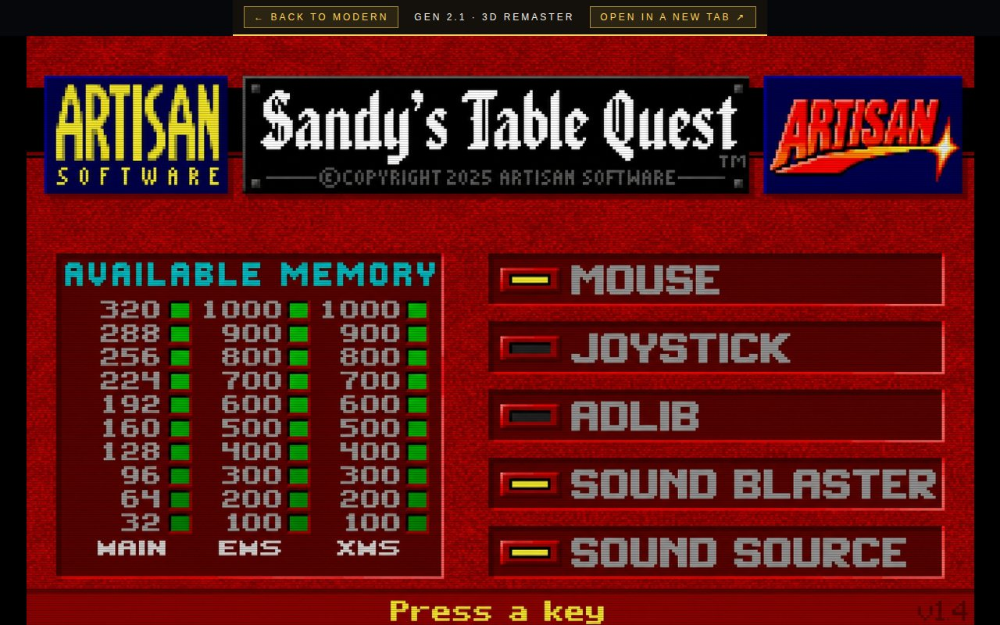

**What "the same game" means.** Across every generation since 2.1 the six ASCII maps, the weapon numbers (damage,
cooldown, paint cost), the enemy stats and behaviours, the pickups and scoring, the story text and the nine songs are
identical. The modern build's `config.js` and `levels.js` diff-match the classic's, and a per-floor collision hash of
walls, props and spawn is checked at every gate.

## The game

### Six floors of Cartel HQ

<table>
  <tr>
    <td width="50%">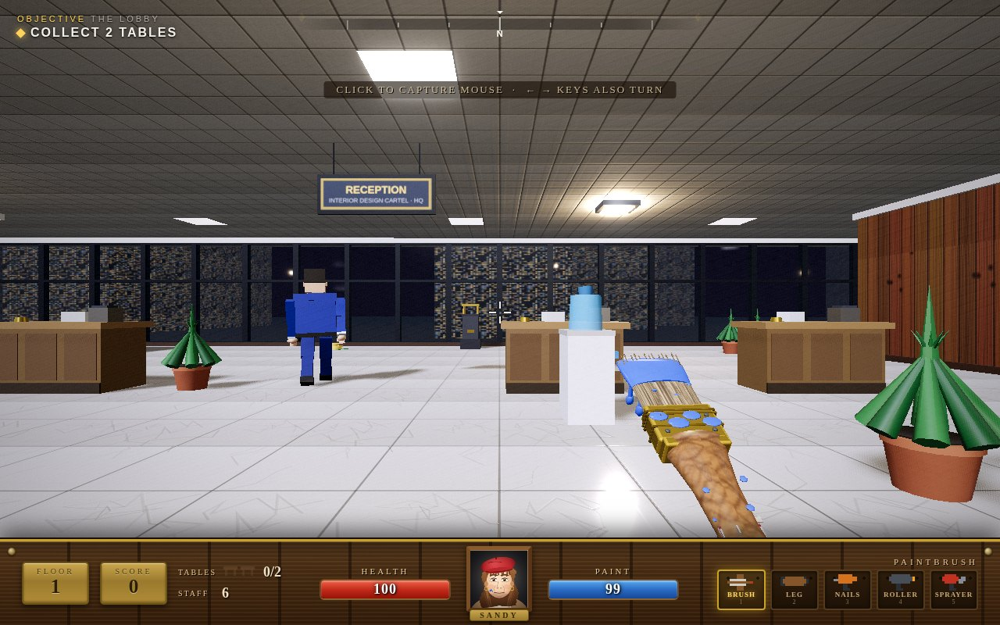</td>
    <td width="50%">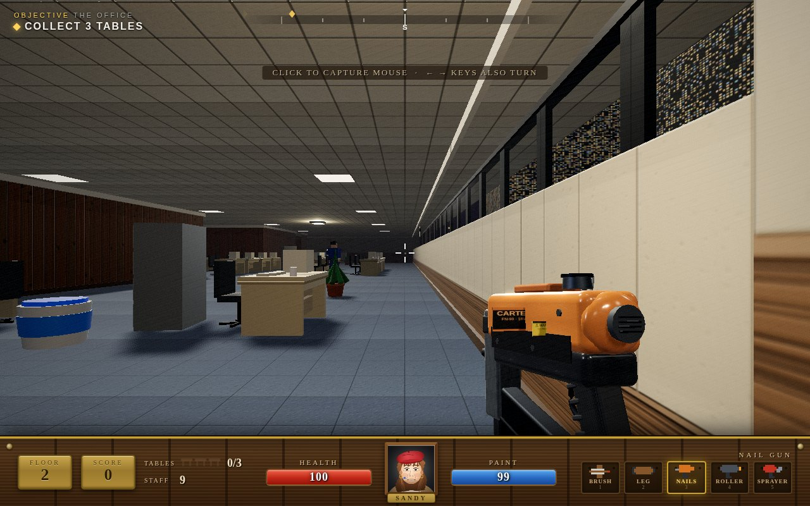</td>
  </tr>
  <tr>
    <td align="center"><strong>1 · The Lobby</strong><br />Ground floor. Smile for the receptionist.</td>
    <td align="center"><strong>2 · The Office</strong><br />Cubicle farm. The guards are unionized.</td>
  </tr>
  <tr>
    <td>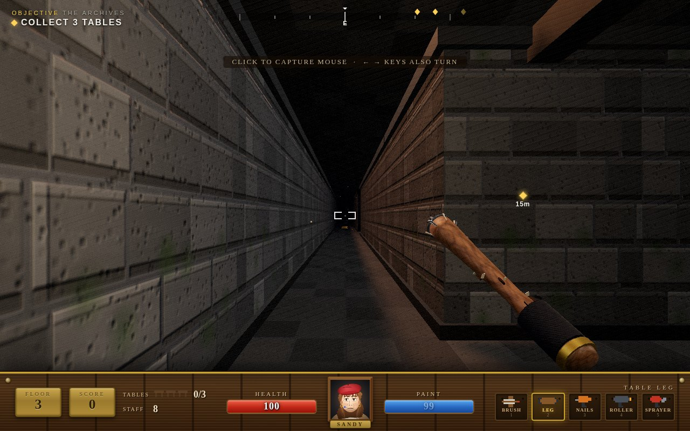</td>
    <td>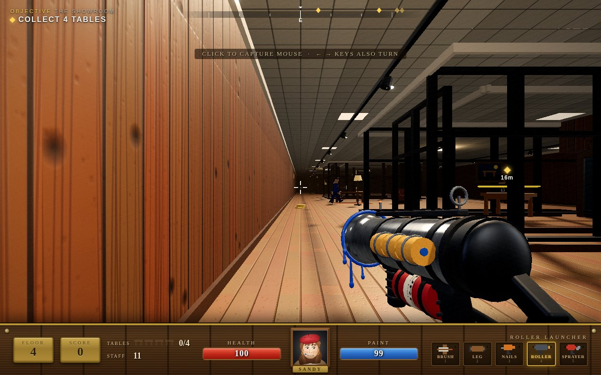</td>
  </tr>
  <tr>
    <td align="center"><strong>3 · The Archives</strong><br />Where they bury the warranty claims.</td>
    <td align="center"><strong>4 · The Showroom</strong><br />Fast furniture as far as the eye can see.</td>
  </tr>
  <tr>
    <td>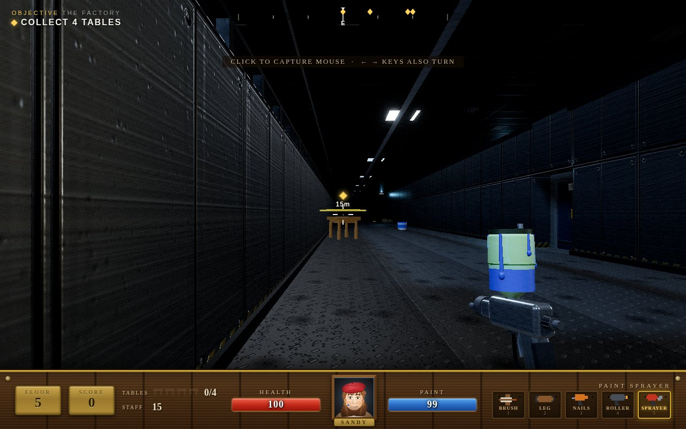</td>
    <td>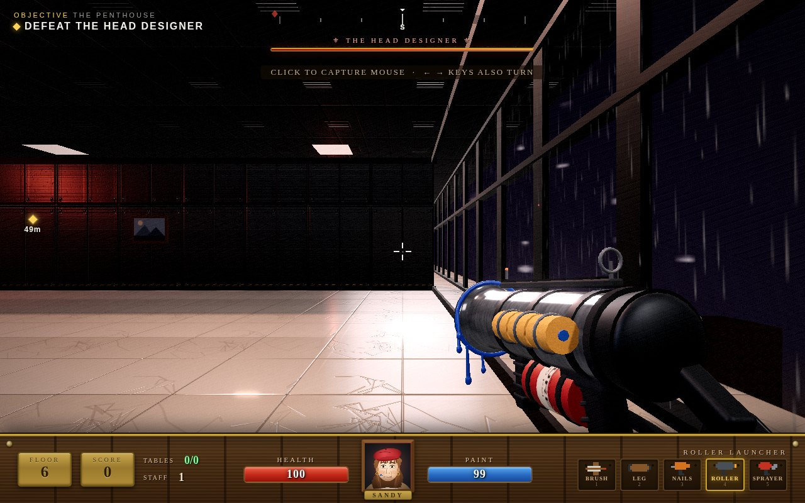</td>
  </tr>
  <tr>
    <td align="center"><strong>5 · The Factory</strong><br />Where masterpieces become particle board.</td>
    <td align="center"><strong>6 · The Penthouse</strong><br />The Head Designer will see you now.</td>
  </tr>
</table>

| Floor | Tables | Staff | Music |
|:-:|:-:|:-:|:--|
| 1 · The Lobby | 2 | 6 | Beige Carpet Lounge |
| 2 · The Office | 3 | 9 | Cubicle Crusade |
| 3 · The Archives | 3 | 8 | Dust & Echoes |
| 4 · The Showroom | 4 | 11 | Particle Board Funk |
| 5 · The Factory | 4 | 15 | Assembly Line Fury |
| 6 · The Penthouse | boss | 1 | The Final Critique |

Plus *Workshop Dreams* on the menu and *The Artisan's Lament* under the story crawl: nine songs, all synthesized in
real time.

### Sandy's arsenal

<table>
  <tr>
    <td width="33%">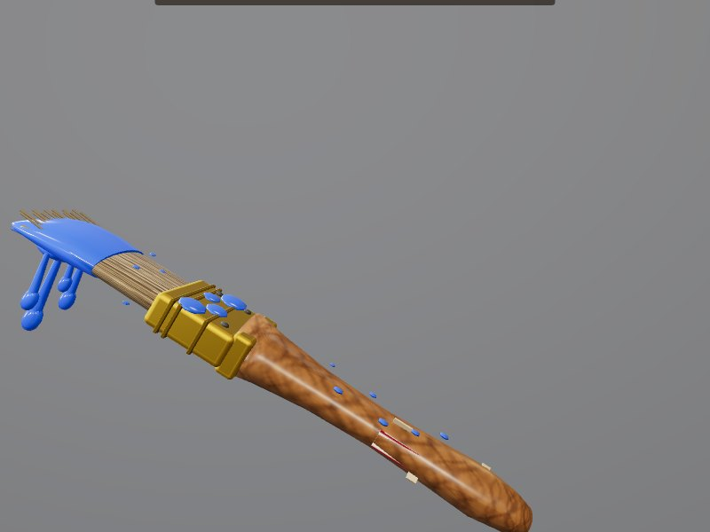</td>
    <td width="33%">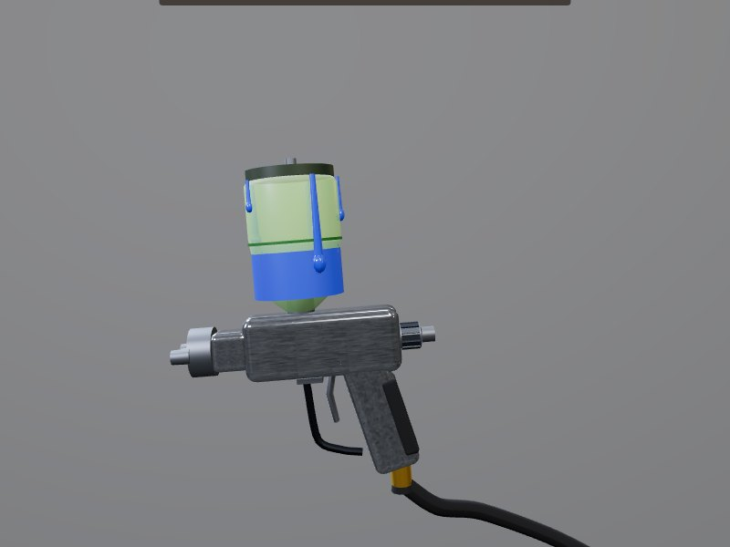</td>
    <td width="33%">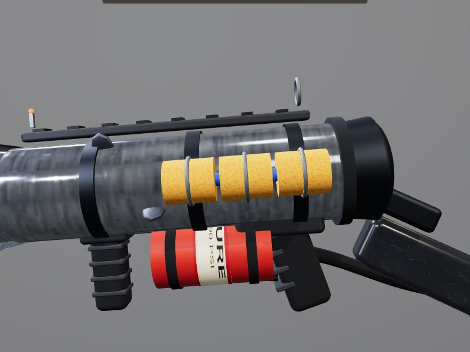</td>
  </tr>
</table>

| Slot | Weapon | Role | Found |
|:-:|:--|:--|:--|
| `1` | **Paintbrush** | Auto-fire, lit paint projectiles, unlimited courage, limited paint | start |
| `2` | **Table Leg** | Melee. No ammunition, no respect for personal space, wrecks furniture | Floor 2 |
| `3` | **Nail Gun** | Fast, tight spread, silver nails for stapling blazers shut | Floor 2 supply / Floor 3 |
| `4` | **Roller Launcher** | Slow lob with splash damage for giving whole rooms a coat | Floor 4 |
| `5` | **Paint Sprayer** | Full-auto, wide spread, for the late-game crowd | Floor 5 |

Weapons persist between floors. Select with `1`–`5`, cycle with `Q` or the wheel, aim down sights with the right
mouse button, quick-melee with `V`. Floor Select grants the arsenal a run would have found by then.

**Field supplies.** Tables are the objective (+500). Blue paint buckets restore 14 paint, Fritos restore 25 health
(sprite-for-sprite from the original), cash and gold bars are score, and about one destroyed cabinet in eight hides
money.

### The Cartel

| Enemy | Threat | Behaviour |
|:--|:--:|:--|
| **Guard** | Low | Blue suits, numerous, volume over aim |
| **Manager** | Medium | Gray suits and glasses, better movement, some shot leading |
| **Executive** | High | Black suits, fast, strong shot leading |
| **Head Designer** | Boss | Oxblood suit and cape. Phase two under half health: faster, paired volleys, supply drops in a cover-filled arena |

Staff alert nearby allies when they spot Sandy, orbit and strafe at range, open doors while chasing, and stagger their
shots so the result is pressure and crossfire rather than a firing squad.

### The bench

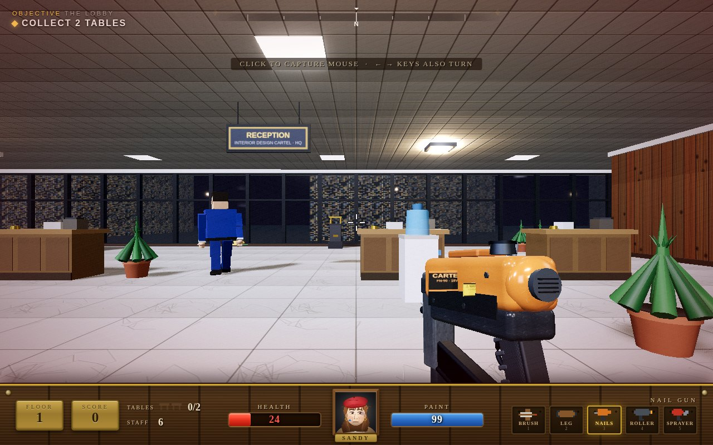

The carved-workbench status bar from the classic is the HUD: brass plaques for floor and score, the table tally,
health and paint, the pegboard arsenal, and **Sandy's portrait in the middle**, painted from the cover art. She glances
around, blinks, winces toward the side she was hit from, grins at pickups, squints while aiming, bruises as health
falls, and flinches when the Head Designer rages. Sixteen expressions in all.

### The story

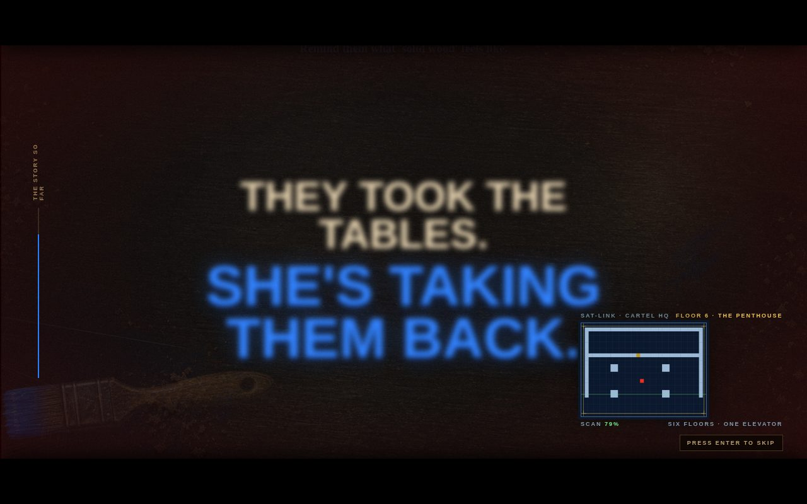

In the year 199X, the Interior Design Cartel declared war on durability. They replaced craftsmanship with fast
furniture: flimsy, soulless, impossible to repair. St. Louis fell first. Then the world. But one artisan refused to
fold. When they raided her workshop, they made one fatal mistake. **They left her alive.**

The full crawl plays after New Game, verbatim from the original, over a satellite plan of the floor ahead.

## Controls

| Input | Action |
|:--|:--|
| `W` `A` `S` `D` | Move and strafe |
| Mouse | Look (click the game to capture the pointer) |
| `←` `→` | Turn without mouse capture |
| Left click / `Ctrl` | Fire; hold for automatic weapons |
| Right click / `C` | Aim down sights (hold or toggle, see Options) |
| `Space` | Jump |
| `Shift` / `Alt` | Sprint hold / sprint toggle |
| `E` | Open an adjacent door |
| `1`–`5`, `Q`, wheel | Select or cycle weapons |
| `V` | Quick melee with the table leg |
| `F` | Inspect the weapon |
| `Tab` | Tactical map |
| `[` `]` | Mouse sensitivity |
| `U` | Mute |
| `Esc` | Pause (losing focus also pauses) |

The main menu opens the persistent global scoreboard directly. Options also includes generation, scoreboard, post-processing, field of view, mouse sensitivity, look smoothing, aim sensitivity, aim and
sprint hold/toggle, invert look, head bob, sound. Settings persist in the browser.

The upper-right menu icons link to [Chris on X](https://x.com/ChrisSotraidis) and
[GitHub](https://github.com/chrissotraidis). Global scores refresh every minute while the scoreboard is visible;
the Refresh scores button checks immediately. The hosted game currently requires a keyboard and mouse.

The global scoreboard accepts **New Game** results on defeat or victory, ranking the top 20 by campaign progress, then score. Each row shows the furthest floor reached or COMPLETE. Floor Select and retries after defeat are practice. Eligible players can sign a result with a name of up to 10 characters. Existing completed-campaign scores retain their completed status.

## Build from source

Node.js 20.19+ or 22.12+.

```bash
git clone https://github.com/chrissotraidis/tablequestIII.git
cd tablequestIII
npm ci
```

| Command | What it does |
|:--|:--|
| `npm run dev` | Modern build, dev server with hot reload on `http://localhost:5174` |
| `npm run build` | Modern single-file build → `dist/index.html` (the shipped game) |
| `npm run preview` | Serve the built file on `http://localhost:4174` |
| `npm run serve:scoreboard` | Serve `dist/` plus the persistent scoreboard API on `http://localhost:4176` |
| `npm run test:scoreboard` | Verify eligibility, concurrent writes and restart persistence using an isolated temporary database |
| `npm run test:leaderboard-client` | Check bounded retries/timeouts, offline behavior and late submission isolation |
| `npm run test:sanity` | Check controls, delayed state changes, artwork and GPU resource cleanup against the local game |
| `node tools/perf_sanity.mjs http://127.0.0.1:5174/` | Measure all six floors at 2654×1738 and stress furniture destruction |
| `npm run report:telemetry` | Summarize sessions, play time, floors, performance, audio underruns and errors from the VPS telemetry log |
| `npm run dev:classic` / `build:classic` | The frozen 2.1 generation from `classic/` → `dist/classic/index.html` |
| `npm run build:all` | Both |
| `npm run check:classic` | Verify the classic generation is byte-identical to its tag |
| `node tools/followup_sanity.mjs http://127.0.0.1:4178/` | Boss audio, menu cycles, mouse recapture event regression and visibility recovery |
| `node tools/followup_gameplay_sanity.mjs http://127.0.0.1:4178/` | Two active audio sessions, sprayer alignment, defeat submissions and menu layout (use isolated test data) |
| `npm run validate:levels` | Map enclosure and reachability for all six floors |
| `npm run smoke` | Headless boot → menu → crawl → every floor, with screenshots; fails on console errors |

The build inlines the modern game code and artwork into `dist/index.html` (about 11.6 MB). Older generations ship
beside it in `dist/generations/`; keep that directory when copying the package. Wall textures, models and the
soundtrack are generated by code at runtime.

`npm run dev` also serves the local scoreboard and telemetry API using the same file-backed service as the packaged
server. Opening `dist/index.html` directly supports offline play; global rankings require the hosted service.
The browser checks use installed Chrome or Brave when available. Set `TQ_BROWSER_PATH` for another Chromium build,
or `TQ_SOFTWARE_RENDERER=1` for software rendering; software frame timings do not measure the hardware GPU.

The scoreboard server stores its small JSON database in `data/leaderboard.json` using atomic writes. Set `HOST`, `PORT` and
`TQ_DATA_FILE` to choose the VPS bind address, port and persistent volume. It exposes `/api/health`, issues a run token when New Game begins, and accepts
sequential floor checkpoints before allowing one final submission; this keeps Floor Select and duplicate submissions
out of the rankings. Put the service behind HTTPS and a reverse proxy when it is hosted publicly.

For Zo Computer, use its registered HTTP Service and follow the [deployment guide](docs/online/ZO_DEPLOYMENT.md)
and [environment example](deploy/zo.env.example). Run one writer process with persistent files outside the release directory.
Static downloads, telemetry and ranked-run requests use separate handling/budgets suitable for a shared network.
Readiness checks storage access, corrupt state is preserved, and the client can retry the latest checkpoint safely.
Run creation and final submissions are not automatically retried after an ambiguous failure. Rankings are casual,
client-reported scores; a token and ordered checkpoints do not prove honest gameplay.

Runtime diagnostics are privacy-light. The game keeps a bounded local log and sends pseudonymous technical events to the
same-origin server every 15 seconds, with warnings/errors queued for an immediate send. Those events cover session duration, floor loads, frame pacing, adaptive-quality
changes, audio scheduler and device-output underruns, pointer lock, weapon changes, ranked-run requests and uncaught errors. The server
appends them to `data/telemetry.jsonl`; set `TQ_TELEMETRY_FILE` to place that file on a persistent VPS volume. It records
timezone and, when supplied by a trusted reverse proxy, a two-letter country code. It never stores a raw IP address.
Setting a private `TQ_TELEMETRY_IP_SALT` adds a non-reversible short network identifier for repeat-session estimates.
Run `npm run report:telemetry` for a readable operational summary. In the browser console, `TQ.logs()` returns the local
entries and `TQ.downloadLogs()` exports them as JSON for a bug report. The VPS server also writes one structured JSON
line per HTTP request to standard output.

The Escape menu includes persisted mouse and aim sensitivity, look smoothing and keyboard remapping. Rendering starts
with a capped pixel ratio, reduced shadow cost and fewer dynamic lights; after two sustained slow measurement windows it
automatically disables bloom and lowers internal resolution. Music is scheduled 500 ms ahead to survive ordinary render
hitches; longer stalls skip missed beats instead of scheduling a CPU-heavy catch-up burst. Music transitions crossfade,
synthesized effects use short de-click ramps, and the output passes through a headroom-aware compressor and safety limiter.

## Documentation

The modern build was produced by fifteen goal-based loops, each with a written goal, a verdict-first log and
screenshot evidence. **Start at [`docs/modern/INDEX.md`](docs/modern/INDEX.md).**

| Document | |
|:--|:--|
| [`docs/modern/GOAL_LOOP.md`](docs/modern/GOAL_LOOP.md) | The contract: baseline review of the classic, the "forget nothing" preservation inventory, the mid-2000s target, the rules |
| [`docs/modern/PROGRESS.md`](docs/modern/PROGRESS.md) | The log of every pass, rounds 1–15, with what was wrong, what was done, and where the evidence is |
| [`docs/modern/GOAL_LOOP_2.md`](docs/modern/GOAL_LOOP_2.md) … [`GOAL_LOOP_11.md`](docs/modern/GOAL_LOOP_11.md) | The goal documents for each round |
| [`docs/modern/HANDS_REINTRODUCTION.md`](docs/modern/HANDS_REINTRODUCTION.md) | First-person hands and arms are parked behind a switch; this is where they are and how to bring them back |
| [`docs/modern/design.md`](docs/modern/design.md) | Design chapter for the modern presentation |
| [`docs/evidence/comparison.md`](docs/evidence/comparison.md) | Classic vs modern, every screen and floor side by side |
| [`classic/design.md`](classic/design.md), [`classic/design-qa.md`](classic/design-qa.md) | The classic generation's own design notes and menu QA |
| [`CHANGELOG.md`](CHANGELOG.md) | Release notes |
| [`docs/online/GOAL_LOOP.md`](docs/online/GOAL_LOOP.md) | Stable baseline, goals and acceptance gates for social links, Zo preparation and Arena planning |
| [`docs/online/PROGRESS.md`](docs/online/PROGRESS.md) | Implementation evidence and remaining live deployment checks |
| [`docs/online/ARENA_PLAN.md`](docs/online/ARENA_PLAN.md) | Proposed eight-player lobby/deathmatch mode and adaptations of all six maps; not implemented |
| [`docs/online/ARENA_RESEARCH.md`](docs/online/ARENA_RESEARCH.md) | Technical research behind the Arena plan |

## The classic generation

<p align="center">
  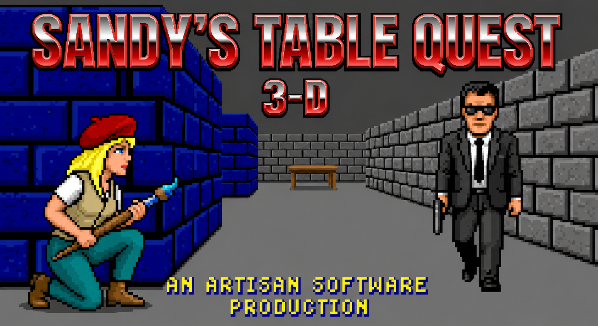
</p>

Generation 2.1 is still here, untouched, and still documented. Its source is under `classic/`, it builds with
`npm run build:classic`, and it is bundled into the main game as **Versions → 2.1**. These are its own captures:

<table>
  <tr>
    <td width="50%">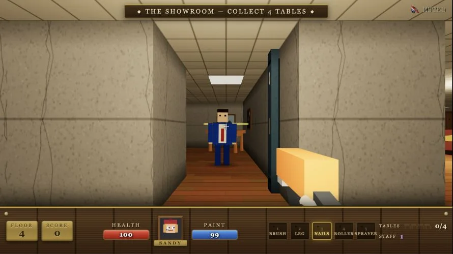</td>
    <td width="50%">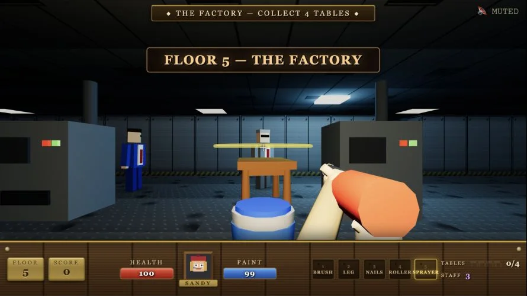</td>
  </tr>
  <tr>
    <td>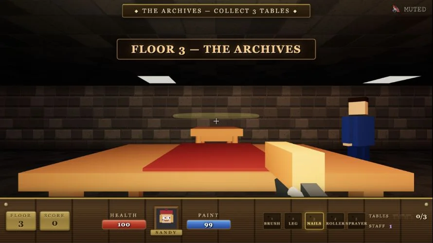</td>
    <td>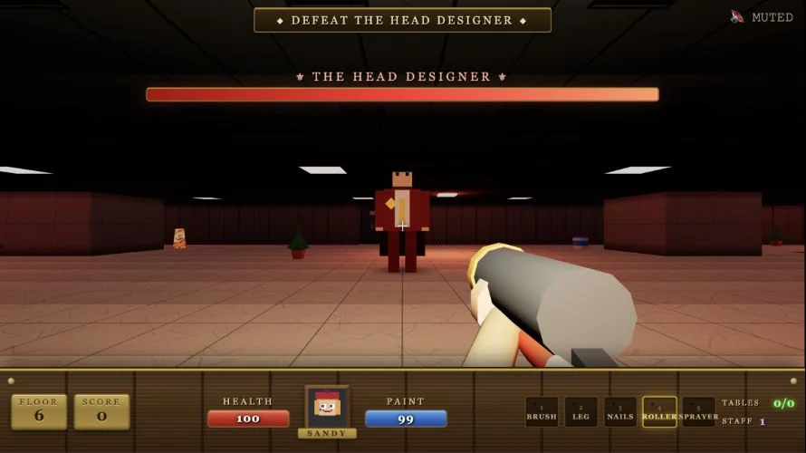</td>
  </tr>
</table>

| | Original 1 (199X) | Classic 2.1 | MODERN 3 |
|:--|:--|:--|:--|
| **Renderer** | 320×200 CPU raycaster | three.js, real geometry, fog, dynamic lights, ACES | Shadow maps, normal and roughness maps, trim and windows, post-processing (bloom, grain, vignette, per-floor grade) |
| **Campaign** | Four levels | Six floors, destructible props | The same six floors, set-dressed per zone |
| **Weapons** | Brush and leg | Five, with Sandy's arms | The same five as detailed floating hard-surface tools, aim-down-sights, recoil, swap |
| **Enemies** | Billboards | Twelve-box figures, pack AI | Proportional bodies, layered animation, callouts, the same AI |
| **HUD** | Status bar | The carved workbench | The workbench again, Sandy's portrait painted from the cover art, compass and objective marker above |
| **Front-end** | Title card | Workbench menu, story crawl | Workbench menu over a live 3D backdrop, cinematic crawl, operations board, loading cards, Versions |
| **Audio** | Four synth songs | Nine songs, ~32 SFX | The same nine songs re-orchestrated, ambience beds, dynamic mix |

## Under the hood

- **three.js** renderer with merged world geometry, per-floor lighting and grading, a separate 56° camera for the weapon layer, and an EffectComposer post stack
- **ASCII-authored levels** compiled at runtime into walls, doors, gates, props, zones and pickups (identical across generations 2.1 and 3)
- **Code-generated everything**: textures, props, enemies, weapons, the soundtrack (a Web Audio synth engine with a look-ahead sequencer) and the SFX. The original 199X artwork is the only hand-made runtime asset
- **Single-file Vite build**, plus a headless playtest harness (`TQ` in the console) and the tools under `tools/` that every gate runs: smoke, collision hashes, campaign autopilot, screenshot sheets

<details>
<summary><strong>Repository layout</strong></summary>

```text
tablequestIII/
|-- index.html, src/            MODERN (generation 3) — UI shell and engine
|-- dist/index.html             the MODERN single-file shell and generation player
|-- public/generations/         Original 1, v1 (2.0), and v2 (2.1) single-file builds, bundled beside the main build
|-- classic/                    generation 2.1 source, frozen byte-for-byte (npm run dev:classic)
|-- tools/                      smoke, collision hashes, campaign bot, screenshot sheets, validators
|-- server/                     static production server and persistent global scoreboard API
|-- docs/modern/                goal loops, progress log, design, hands reintroduction, INDEX.md
|-- docs/evidence/              the screenshots every verdict was written from
|-- docs/smoke/modern/          latest smoke run on the built file
`-- docs/readme/                README captures
```

</details>

## Credits

- **Original game, concept, story and artwork:** *Sandy's Table Quest* by Artisan Software, 199X
- **Engine:** [three.js](https://threejs.org/)
- **Music and sound:** generated in real time with the Web Audio API
- **Hand models (parked):** WebXR input-profiles `generic-hand`, MIT, see `src/assets/hands/LICENSE.md`
- **Inspiration:** *Wolfenstein 3D*, *DOOM*, *Call of Duty 2* and *4*, and the golden age of shooters

## License

Released under the [MIT License](LICENSE).

<p align="center">
  <strong>Fight the Cartel. Recover the tables. Defeat the Head Designer.</strong>
</p>

### Daily play reports and incident logs on a VPS

Serve the built game with `npm run serve:scoreboard` behind your HTTPS reverse proxy. Set
`TQ_DATA_FILE=/srv/tablequest-data/leaderboard.json` and
`TQ_TELEMETRY_FILE=/srv/tablequest-data/telemetry.jsonl` to keep both files on persistent storage outside `dist/`.
A static-only host does not collect these logs. The service appends pseudonymous session events to JSONL;
logs are retrieved over your existing SSH access, not a public HTTP download endpoint.

```sh
npm run pull:telemetry -- --host YOUR_SSH_ALIAS --remote /srv/tablequest-data/telemetry.jsonl
npm run report:telemetry -- data/vps-telemetry.jsonl --date 2026-09-06 --timezone Asia/Tokyo
npm run report:telemetry -- data/vps-telemetry.jsonl --session SESSION_ID
npm run report:telemetry -- data/vps-telemetry.jsonl --session SESSION_ID --json > data/incident.json
```

The pull command uses your SSH configuration and replaces the local copy only after a successful transfer.
`TQ_VPS_HOST` and `TQ_VPS_TELEMETRY_FILE` can replace the corresponding arguments. No VPS address or credentials
are stored in the game. Telemetry rotates at `TQ_TELEMETRY_MAX_BYTES` (16 MiB by default), retaining the current file
and one `.1` backup. Download/archive both if you need the earlier timeline; rotation replaces the older backup.
Set a separate bounded retention policy for the service's stdout request logs.

Reports distinguish **played sessions**, **unique browsers that played**, and **opened-only sessions**.
A random ID in local storage estimates returning browsers; it cannot identify individual people, and clearing storage
or using another browser counts separately. Older logs without this ID cannot supply that estimate. Automated browser
runs are excluded by default (`--include-tests` includes them); older automation logs without the flag cannot be classified.
Dates use the requested timezone, defaulting to UTC. Active minutes exclude pauses and time in hidden tabs; these are
observed client events and can be incomplete if the browser crashes or cannot reach the service.

Each current-build event includes its floor/state, sequence, session ID, and source-build fingerprint. The timeline
includes floor changes, warnings/errors, frame timings, song starts/stops, mute changes, interruptions/resume attempts,
and separate music/effects/output levels in performance samples. Retries are deduplicated in the report. An incomplete
last JSONL line is skipped and counted, so a live-server copy remains usable.

If sound cuts out, use **Pause → Download Error Logs** to save the current incident, then **Pause → Recover Audio**. Recovery records the current audio state and recreates the sound engine without
resetting the floor. It preserves the sound toggle. `TQ.audioHealth()` inspects the current state; `TQ.downloadLogs()`
exports the local recent-event buffer with build/session identification and upload status. Audio health is sampled every 15 seconds even while paused; supported browsers also report device playback underruns, output-clock progress and output latency. Uploads time out after eight seconds and retain events for retry; queue losses are counted. Runtime errors include bounded stack traces. The browser analyser cannot prove that audio reached the speakers, so a running
context alone does not close an audio report. The server log retains the longer timeline.

`npm run test:telemetry` checks report counting and downloads; `npm run test:incidents` checks Floor 3 audio continuity,
interruption recovery, paint placement, and the pause menu.

For the Level 2 output-underrun investigation and validation limits, see [the incident report](docs/online/AUDIO_INCIDENT_2026-09-09.md).

The September 9 follow-up reduces dense music synthesis and high-frequency hiss, fixes sprayer muzzle alignment and mouse recapture, improves Floor Select and adjusts the boss encounter. See [the follow-up report](docs/online/FOLLOWUP_2026-09-09.md) for changes, evidence and remaining listening checks.
