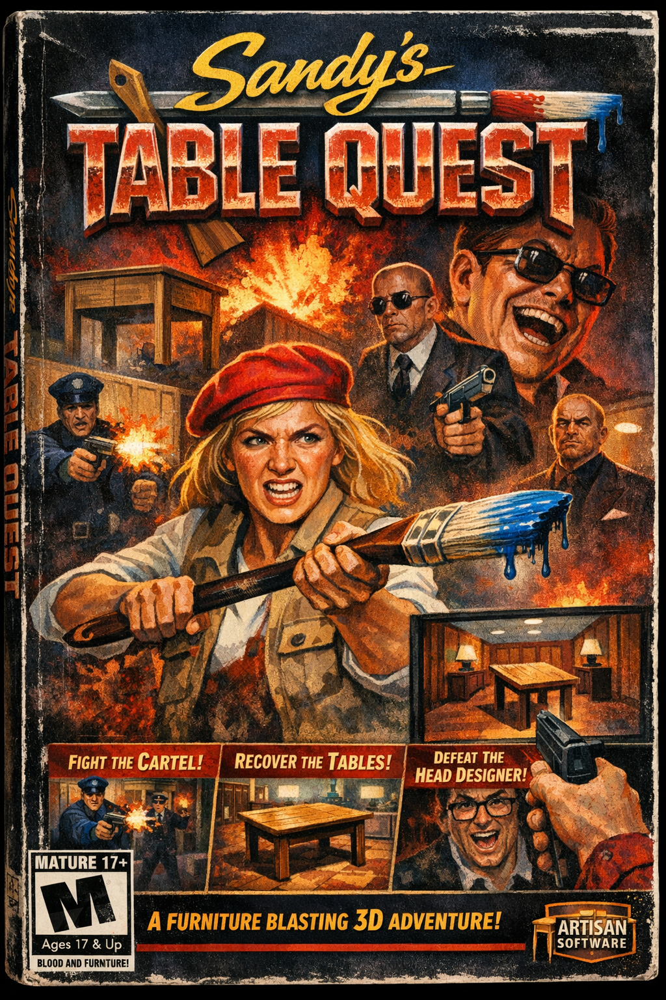

# 🎮 SANDY'S TABLE QUEST 3D

<p align="center">
  
</p>

<p align="center">
  <strong>A full 3D remaster of the Artisan Software classic — running entirely in your browser</strong>
</p>

<p align="center">
  <em>"In the year 199X, Sandy's masterpieces were stolen by the Interior Design Cartel..."</em>
</p>

---

## 📖 About the Game

**Sandy's Table Quest 3D** is a ground-up remake of the original raycaster *Sandy's Table Quest*, rebuilt on a true WebGL engine. You play as Sandy, an eccentric artisan furniture maker, fighting through **six floors** of the Interior Design Cartel's headquarters to reclaim your stolen masterpiece tables — now with real 3D geometry, dynamic lighting, physics-based movement, animated enemies, and an all-new procedural soundtrack.

The original boot screens, title art, box art, and story are lovingly preserved from the 199X release.

### ✨ Features

- **True 3D Engine** — WebGL via three.js: real geometry, per-floor fog and lighting palettes, ACES tone mapping, muzzle flashes, screen shake, paint-splat decals, and particles
- **Six Unique Floors** — from the marble Lobby to the Penthouse boss suite, each with its own textures, lighting, and music
- **Enemies That Hunt** — pack alerts, combat strafing, shot leading by rank, door breaching, and a two-phase final boss
- **Three Weapons** — the trusty Paintbrush, the hidden Table Leg (melee), and the full-auto Paint Sprayer
- **Procedural Everything** — all textures, models, music, and sound effects are generated in code; the original artwork is the only asset
- **Single-File Distribution** — the entire game compiles to one HTML file

---

## ▶️ Play

### Option 1: Play Immediately (Pre-built)

1. **Download the repository** (green "Code" button → "Download ZIP", or clone it)
2. **Open `dist/index.html`** in any modern browser (Chrome, Firefox, Safari, Edge)
3. **Play!** — the whole game is in that one file

### Option 2: Build from Source

Requires [Node.js](https://nodejs.org/) v18+.

```bash
git clone https://github.com/chrissotraidis/tablequestIII.git
cd tablequestIII
npm install
npm run dev      # → http://localhost:5179
npm run build    # → dist/index.html (single file)
```

---

## 🕹️ How to Play

### Goal

Collect all the **Tables** on each floor to unlock the elevator and ride it up. Reach the Penthouse and defeat the **Head Designer** to win!

### Controls

| Key | Action |
|:---:|:---|
| `W A S D` | Move / strafe |
| Mouse (click to capture) | Look — full yaw + pitch |
| `←` `→` | Turn (classic mode) |
| `Space` / Left click | Fire weapon (hold for continuous) |
| `E` | Open doors (any adjacent door) |
| `Shift` | Sprint (with FOV kick) |
| `1` `2` `3` / `Q` / Wheel | Switch / cycle weapon |
| `[` `]` | Mouse sensitivity (saved) |
| `Tab` | Minimap |
| `U` | Mute |
| `Esc` | Pause (also auto-pauses on focus loss) |

### Items

| Item | Description |
|:---|:---|
| 🪑 **Tables** | Your stolen masterpieces — collect them all! |
| 🩹 **First-Aid Wood Polish** | Restores +25 HP (max 100) |
| 🎨 **Blue Paint Bucket** | Replenishes +14 paint |
| 💰 **Cash & Gold Bars** | Pure score |
| 🪵 **Table Leg** | Hidden melee weapon — no ammo required |
| 🔫 **Paint Sprayer** | Hidden full-auto industrial paint delivery |

### Enemies

| Enemy | Difficulty | Description |
|:---|:---:|:---|
| **Guard** | Easy | Blue suit, numerous, can't lead a target |
| **Manager** | Medium | Gray suit and glasses, leads shots a little |
| **Executive** | Hard | Black suit and hat, fast, leads shots well |
| **Head Designer** | BOSS | Two phases. Bring paint. Use the pillars. |

> 💡 Staff alert each other when they spot you, strafe in combat, and open doors while chasing. The crossfire is staggered so you're pressured, not liquefied — and you get three seconds of grace at each spawn.

---

## 🏢 Six Floors of the Cartel HQ

1. **The Lobby** — marble and beige. Smile for the receptionist.
2. **The Office** — the cubicle farm from the original, remastered.
3. **The Archives** — a mossy dungeon where warranty claims are buried.
4. **The Showroom** — fast furniture as far as the eye can see.
5. **The Factory** — where masterpieces become particle board.
6. **The Penthouse** — the Head Designer will see you now. **BOSS FIGHT.**

---

## ⚙️ What's New vs. the Original

| | Original (1.0) | 3D Remaster (2.x) |
|:--|:--|:--|
| Renderer | 320×200 CPU raycaster | WebGL (three.js), real 3D geometry, fog, dynamic lights, ACES tone mapping |
| Levels | 4 | **6**, each with its own palette, materials, fog, and music |
| Enemies | Billboard sprites | Animated 3D models with walk cycles, attack telegraphs, death falls, pack AI, shot leading, door breaching |
| Weapons | Paintbrush, table leg | + full-auto **Paint Sprayer**; viewmodels with sway, recoil, and muzzle-flash lighting |
| Physics | Axis-aligned cell checks | Circle-vs-grid sliding collision, velocity smoothing, projectile travel, mercy windows |
| Doors | Cells that vanish | Animated sliding doors, sinking elevator gates |
| Effects | — | Splat decals, particle bursts, screen shake, hit markers, damage vignette, blob shadows |
| Audio | Procedural synth (4 songs) | Same synth architecture, **9 all-new 16-bar compositions** + expanded SFX |
| UI | DOM HUD | Live pixel-art Sandy face, minimap, boss health bar, toasts, pause menu, floor select, persistent high score |
| Boss | Stat block | Two-phase fight with rage volleys, supply drops, and a cover-built arena |

---

## 🧱 Architecture

```
tablequestIII/
├── README.md
├── index.html           # UI shell: screens, HUD, menus
├── vite.config.js       # single-file build via vite-plugin-singlefile
├── dist/
│   └── index.html       # the playable game (one file!)
├── src/
│   ├── main.js          # boot sequence, menus, state machine, render loop
│   ├── game.js          # play session: player, combat, enemy AI, pickups
│   ├── world.js         # ASCII map → merged 3D geometry, doors, lighting
│   ├── levels.js        # six floor definitions (ASCII maps + themes)
│   ├── models.js        # procedural 3D models (enemies, tables, viewmodels)
│   ├── textures.js      # 16 procedural canvas materials with fake-AO
│   ├── audio.js         # synth engine, sequencer, 9 songs, ~25 SFX
│   ├── effects.js       # particles + paint splat decals
│   ├── hud.js           # HUD, Sandy face, minimap
│   ├── input.js         # keyboard + pointer lock
│   ├── config.js        # tuning constants
│   └── assets/          # original 199X artwork (boot screens, box art)
└── tools/
    └── validate_levels.js  # map linter: enclosure + BFS reachability
```

### Build System

Vite bundles the engine, inlines the original artwork as base64, and emits a single zero-dependency `dist/index.html` — the modern descendant of the original's `build.js` concatenation script.

### Playtest Harness

The browser console exposes `TQ` — godmode, teleport, floor warp, state snapshots, and a full **autopilot** (`TQ.botGoto`, `TQ.botFight`) that runs inside the simulation loop. Every floor of this game was cleared end-to-end by automated walkthroughs, and the boss fight is certified winnable (die-once-learn, win-the-retry difficulty).

---

## 📜 Story

Sandy is a legendary furniture artist whose masterpiece tables are known throughout the land. One fateful day, the **Interior Design Cartel** — a shadowy syndicate of rival decorators — stole her creations.

Now Sandy must infiltrate their corporate headquarters: six floors of beige carpet, particle board, and armed middle-management, armed only with a paint-flinging brush and a burning desire for justice.

**They took the tables. She's taking them back.**

---

## 🎨 Technical Highlights

### Procedural World
Levels are authored as ASCII maps and compiled at load time into merged buffer geometry — one draw call per material. Doors slide, gates sink, and elevator pads glow, all from map characters.

### Procedural Audio
All music and sound is synthesized in real time with the Web Audio API: subtractive synthesis with filter envelopes and LFOs, convolution reverb, feedback delay, and a look-ahead sequencer playing 16-bar arrangements with counter-melodies, horn stabs, drum fills, and halftime breakdowns.

### No External Assets
Textures, models, music, and SFX are all generated in code. The only files are the original game's boot screens, title card, and box art — preserved as a tribute.

---

## 📄 License

MIT — see [LICENSE](LICENSE). Original concept, story, and artwork from *Sandy's Table Quest* by Artisan Software.

---

## 🙏 Credits

- **Original Game** — *Sandy's Table Quest*, Artisan Software, 199X
- **3D Remaster Engine** — WebGL via [three.js](https://threejs.org/)
- **Music & SFX** — Procedural Web Audio synthesis
- **Inspiration** — *Wolfenstein 3D*, *DOOM*, and the golden age of 90s shooters

---

<p align="center">
  <strong>Happy furniture hunting! 🪑</strong>
</p>
