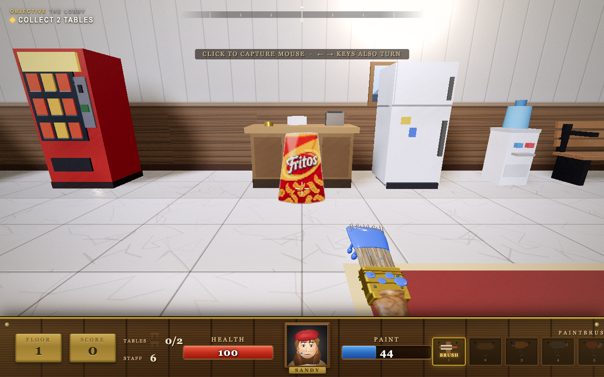

# Local sanity check — 6 September 2026

The current game runs at http://127.0.0.1:5174/. Existing checkout changes were preserved; no commit or publication was made.

## Bugs fixed

- Health pickups were invisible: the static batching pass discarded `THREE.Sprite`. The original Fritos billboard now renders and collecting it restores 25 health (verified 50 → 75).
- Floor changes leaked GPU shadow render targets; the Factory also leaked its hazard-stripe texture. Repeated Office/Factory reloads now retain stable texture and geometry counts after cache warmup.
- Shader compilation alone left texture uploads, shadow maps, the viewmodel and post-processing to the first playable frame. The loading card now stays active until those passes have rendered. Early deploy input is queued.
- Loading/pause time polluted gameplay frame statistics and could permanently reduce graphics quality. Gameplay timing resets on entry; adaptive quality now requires sustained slow frame pacing. Very large viewports respect the pixel budget.
- Furniture damage rebuilt and uploaded every prop on the floor. Four spatial batches retain unaffected buffers. Static baking copies only transformed attributes and avoids constructing throwaway default primitives. All 57 prop/state geometry combinations remain byte-identical to the previous bake output.
- Held aim/sprint/Q keys repeated their toggles/actions. UI input could carry into play, including Space-to-deploy also jumping. Input state is cleared, key repeats do not retrigger actions, and typing in text fields stays out of gameplay.
- Remapped number keys could both move and change weapons. Remappings now take priority over the gameplay shortcut.
- Old death/elevator/boss timers could affect a replacement run. Callbacks are tied to their original player/world. Pausing during death can no longer leave a dead player in active play.
- The Vite server returned API 404s. Local development now mounts the scoreboard service. Offline file play does not attempt unsupported scoreboard requests.
- Simultaneous scoreboard writes could overwrite runs or race on the same temporary file. Mutations are serialized, with an eight-concurrent-run regression check.

## Evidence

Final packaged HTML SHA-256: `f232f92640b196f03abd8810ea1f12f929200e98a2c8d2aee943704181f50097`.

- Build, six-floor map validation, classic integrity, and scoreboard integration passed.
- Full boot → menu → story → loading → play, movement, minimap, pause and all-six-floor smoke checks passed on the served build and offline HTML, with zero failures/errors. Final rendering changes additionally passed the per-floor performance and sanity checks below.
- [Sanity regressions](sanity.json): 18 checks passed, including remap/reset controls, Space deploy, delayed callbacks, health artwork and repeated GPU resource lifetime.
- [Final GPU measurements](performance.json): Chrome/ANGLE Metal on Apple M3 Max, viewport **2654×1738**, render ratio **0.833**, post-processing enabled. Each floor sampled for 180 consecutive frames immediately after render readiness: average **16.6 ms**, p99 **16.8 ms**, **zero frames over 50 ms**, **zero audio underruns**. Draw calls ranged from 124 to 362 in the recorded end frames.
- Office furniture destruction: twelve sequential real prop destructions and rebuilds, **4.6–6.6 ms**, all collisions cleared and all unaffected batches retained. The immediately preceding full-floor implementation measured **30.1–92.5 ms** under the same probe.
- [Campaign autopilot](campaign.json): completed all six floors and reached victory, 8 deaths/retries, score 34,720, zero runtime errors. This run preceded the final batching optimization and input refinements; final geometry equivalence and focused tests cover those changes.
- Decal/debris stress: 200 brush shots, 480 retained decals, 200 debris pieces; approximately 16.7 ms frame average before/after, no page errors.
- Audio: 44 instruments, 8 songs and 35 effects rendered nonzero output. The deliberately quiet footstep measured peak 0.0098; the evidence tool now distinguishes quiet audio from silence.
- [Generation navigation](versions.json): the 2.1, 2.0 and original 199X pages loaded their canvases, each Back button returned, and Modern returned to its menu. Frozen classic files remain untouched.
- [Geometry equivalence](bake-equivalence.json): 19 props × intact/damaged/wreck, with translated/rotated/scaled input; all vertex/index attribute bytes match the pre-change bake and source geometry is not mutated.



These are bounded local checks, not proof that every possible bug is gone. The frame samples cover short windows; the campaign is automated. Cold shader/asset preparation can still take longer behind the loading card on other browsers or machines.

## Reproduce

Start `npm run dev`, then run:

```sh
npm run test:sanity
npm run smoke
node tools/perf_sanity.mjs http://127.0.0.1:5174/
npm run test:scoreboard
npm run validate:levels
npm run check:classic
```

Browser harness calls to `TQ.startGameAt(index)` now return a promise; await it before inspecting a playable floor. Tests choose installed Chrome/Brave; set `TQ_BROWSER_PATH` for another Chromium executable or `TQ_SOFTWARE_RENDERER=1` for software rendering.
