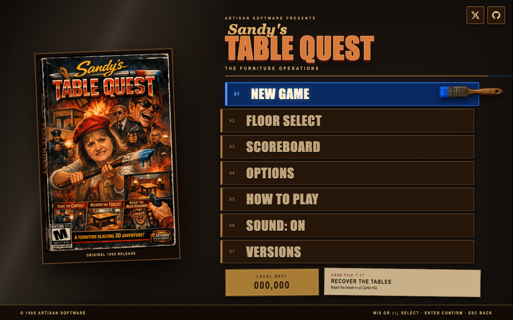
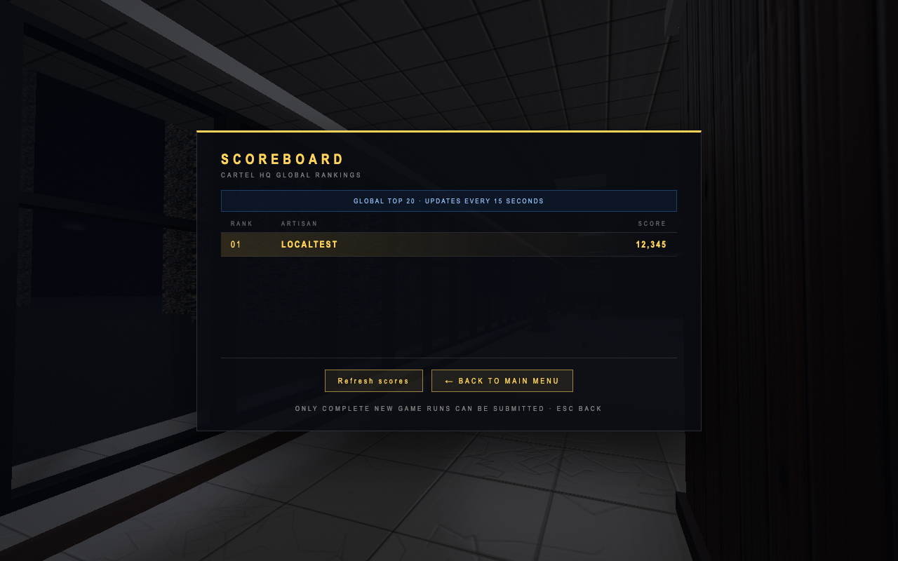

# Online preparation: results and evidence

2026-09-09. **Local implementation and Arena planning pass complete. Public Zo deployment and Arena gameplay remain unperformed.**

The goals are in [GOAL_LOOP.md](GOAL_LOOP.md). The stable source/build remains at `2ebc6c753182192c9eb2940debe961ae465111e4`, protected by the local tag `codex/stable-before-zo-2026-09-09`. Work is isolated on `codex/zo-prep-and-arena-plan`; this pass does not move `main` or publish anything remotely.

## Loop 2 — social links and campaign preparation

Added X and GitHub icon anchors in the main menu's upper-right, using the existing dark/brass presentation. The exact destinations were verified against the contact links on [the creator's personal site](https://www.sotraidis.com/): `https://x.com/ChrisSotraidis` and `https://github.com/chrissotraidis`. They have 44-pixel targets, accessible names, visible focus, `target="_blank"` and `noopener noreferrer`. Narrow-screen spacing reserves a row above the artwork/title. They disappear with the menu during gameplay.

Menu Tab navigation and native activation now coexist with the game's controls. Enter/Space on links, menu buttons, scoreboard controls and the victory submit button do not trigger unrelated global screen actions. Gameplay Tab remains the tactical map.

Server changes keep one Node process and the existing JSON state format. Static downloads no longer compete with API limits; telemetry, reads, starts, checkpoints and scores have distinct shared-peer budgets. Requests are byte-limited and have an upload deadline before entering the serialized write queue. Corrupt/unreadable state is preserved and fails visibly. Health checks actual storage access. Telemetry rotates with a configured size bound. Static responses support HEAD and ETag revalidation. Exact limits and environment settings are in [ZO_DEPLOYMENT.md](ZO_DEPLOYMENT.md).

The scoreboard updates every minute while visible (revised in the follow-up), refreshes on focus, and has a manual Refresh scores button. Closing it stops the timer; stale responses cannot update a reopened screen. Offline/failure copy is visitor-facing, and results outside the retained top 20 no longer claim to have been saved.

Score requests have an eight-second per-attempt deadline. Reads get one retry and checkpoints two; invalid requests are not retried. The server accepts the same latest checkpoint again. A 429's numeric Retry-After is honored up to 60 seconds. Run creation and final score submission are never automatically repeated after an ambiguous response. Exhausted checkpoint failures clearly mark the run unavailable for ranking while the campaign can continue.

## Loop 3 — review and correction

Review identified an older asynchronous submission hazard: a player could submit, start another game, then have the late response read or modify the new run. The handler now captures the original run/name/score, guards concurrent submission, and updates visible status only for that same victory screen. An isolated regression replays the exact handler with a delayed checkpoint and a replacement run.

Review also caught the victory submit button's keyboard conflict, too-fast retries after rate limiting, and final-checkpoint failures not updating the visible victory form. Those were corrected and the client checks rerun. The final failure update preserves any name already entered. No campaign movement, weapons, map data, combat rules, audio or legacy sources were changed.

## Loop 4 — Arena research and concrete plan

[ARENA_RESEARCH.md](ARENA_RESEARCH.md) records a second primary-source research pass and the actual source reuse boundaries. [ARENA_PLAN.md](ARENA_PLAN.md) is the resulting proposed design:

- One eight-slot room, five-minute free-for-all, names, equal-size staff appearance presets, lobby/ready/countdown, room chat, respawns and kills/deaths results.
- All six existing modern floors retained as the map pool, with Arena-only spawn/pickup/circulation overrides and separate per-map acceptance.
- Penthouse and brush/leg first for the technical proof; the complete prototype acceptance requires eight real players. The other maps/tools have explicit subsequent gates.
- Separate Node + `ws` service and native browser WSS; authoritative numeric simulation, bounded messages/queues/projectiles, and explicit disconnect/reconnect/host departure rules.
- First-person camera remains. Existing character rigs become remote-player bodies. Pitch-aware body hits are new Arena logic; campaign combat remains unchanged.

These are documented decisions for later implementation, not working multiplayer controls or an existing live lobby. Earlier exploratory 4–6/10-player room sizes are superseded by the eight-player plan.

## Verification

Test environment: local macOS, Node `v22.12.0`, installed Chromium-family browser via the repository harness. All server/browser ranking fixtures used temporary files under `/tmp`, never local player data or a public board.

| Check | Result and evidence |
| --- | --- |
| Production build | PASS; modern HTML rebuilt from this pass, about 11.66 MB raw / 8.19 MB gzip estimate |
| Shared-peer server integration | [PASS](evidence/scoreboard.log): 30 starts, 180 reads, 120 telemetry batches, 180 checkpoints, independent budgets, restart persistence, idempotency, storage errors, rotation, byte limits, real upload timeout, slow-client queue isolation, HEAD/ETag/private paths |
| Client failures and delayed submissions | [PASS](evidence/client.log): bounded retries/abort, Retry-After, validation failures, no automatic non-idempotent retry, file mode, original-run submission isolation |
| Technical reporting | [PASS](evidence/telemetry.log): existing telemetry/report checks |
| Frozen classic | [PASS](evidence/classic.log); packaged original/v1/v2 SHA-256 values also match the baseline |
| Six maps | [PASS](evidence/levels.log): enclosure/reachability validation |
| Hosted built-game smoke | [PASS](evidence/smoke.log): boot/menu/crawl, all six floors, zero failures and zero console errors |
| Existing control/state/resource checks | [PASS](evidence/sanity.log), [structured result](evidence/sanity.json): 18 assertions, stable warmed resource counts, no errors |
| Offline built-game smoke | [PASS](evidence/offline.log): direct `file://` game through all six floors |
| Packaged runtime | [PASS](evidence/package.log): extracted archive runs with Node built-ins only, serves byte-identical HTML, reports healthy external storage and starts with an empty board |
| Direct UI inspection | Main menu at 1280×720 and 390×844; both social links visible with no title/artwork overlap; keyboard focus/activation leaves main menu intact; scoreboard Refresh/Back work by keyboard |
| Scoreboard update | A score submitted through the separate local API appeared on the already-open board without reopening it |

The in-app inspection verified anchor destinations/attributes and that activation preserved the game screen. It did not establish external X account availability or the in-app browser's popup behavior. The actual destination URLs were independently verified from the creator's website.

## Runtime package and remaining deployment gates

A local, ignored deliverable is at `artifacts/zo-2026-09-09/tablequest-runtime.tgz`, with `CONTENTS.txt` and `SHA256SUMS` beside it. It contains only `dist/` and `server/`, not local scores, telemetry, credentials, dependencies or repository history.

- Archive SHA-256: `98498642f74acdb1b364f751a38f205fe313fcfb8abecb24a7148e05d309a9d0`.
- Modern HTML SHA-256: `1ca774c2091957183154cf8a925f24aec0abe3643faa4688cd75040c6ac9b089`.
- The recovery tag retains the previous source and shipped HTML. Its older server predates these readiness fixes; it is a recovery baseline, not a validated public Zo release.

Follow [ZO_DEPLOYMENT.md](ZO_DEPLOYMENT.md) and [the environment example](../../deploy/zo.env.example) when account access is available. Still required on the actual host: confirm plan/resources and service settings, publish to the returned HTTPS URL, test thirty-client cold downloads and API traffic through Zo's proxy, verify restart/redeployment/data backup, and scan a QR for the final URL. No public URL was invented and no QR was generated for an unverified destination.

Arena still needs its separately specified implementation and host/playtest milestones. The eight-player proposal is not a VPS capacity measurement. Local smoke/resource checks also do not replace a human gameplay or physical speaker/audio acceptance test.

## Level 2 audio follow-up — 2026-09-09

[Incident report](AUDIO_INCIDENT_2026-09-09.md): captured real output underruns missed by the old scheduler-only logs, reproduced sustained stalls with two Level 2 contexts, and isolated delayed per-voice graph cleanup. Finished note/drum/SFX nodes now disconnect explicitly. Added device-output health/clock/voice counters, paused-session heartbeats, bounded upload/resume deadlines, error stacks and a pause-menu log download. The stable baseline and previous preparation commit remain recoverable.

Build `fa08c054dee7` passed a 180-sample two-tab music/firing run: 0.144 s and 0.1333 s total playback underruns across about 200 s, no scheduler errors, bounded live nodes and no sustained cutout. Floor 3 regression, diagnostic fault injection, export/recovery/navigation and hosted log persistence passed. [Validation summary](evidence/audio-2026-09-09.json). Physical replay by the original reporter remains open; existing user tabs were not reset. Current local port 4176 serves the new bundle.

## Gameplay follow-up

The subsequent audio, menu, input, sprayer and campaign progress fixes are recorded in [FOLLOWUP_2026-09-09.md](FOLLOWUP_2026-09-09.md). That report supersedes earlier audio acceptance observations; the user reproduced severe boss output underruns after the first audio pass.
