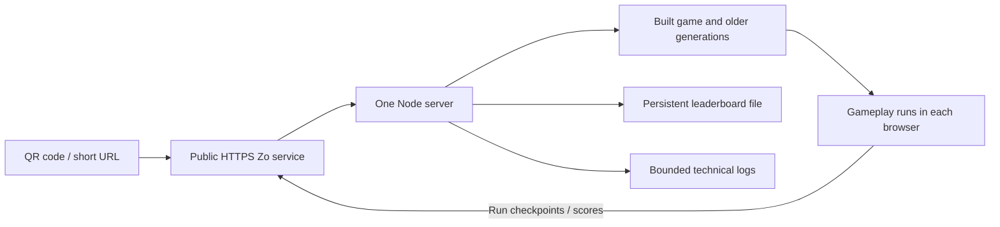

# Zo Computer hosting and Arena research

Historical first research pass. The subsequent [eight-player Arena plan](online/ARENA_PLAN.md) supersedes the
exploratory room sizes here. See [implementation progress](online/PROGRESS.md) for completed campaign readiness
changes and [Zo deployment instructions](online/ZO_DEPLOYMENT.md) for the current recipe.

Research date: 2026-09-09. Repository reviewed at `2ebc6c7`. Research only: no gameplay, server, or deployment configuration changed. The shipped main menu was inspected in a local browser. Three research agents examined Zo hosting, scoreboard readiness, and Arena feasibility.

## Recommendation

Prepare the existing campaign, creator social links, and shared scoreboard for the Friday demonstration. Zo is a suitable hosting candidate. Ten to thirty campaign visitors do not require thirty server-side game simulations: each browser does its own rendering, audio, and gameplay.

Treat Arena as a separate follow-on prototype. Ten to thirty total multiplayer participants is a reasonable capacity target to test, rather than a verified capacity claim. Start with four to six players on one adapted map, then consider three rooms of ten. Keep the stable campaign and frozen legacy generations intact.

## Friday hosting model

Use a registered Zo **HTTP Service** with `node server/scoreboard-server.mjs` as its entrypoint. Zo supports Node and WebSocket services, supplies `PORT`, and restores registered services after computer restarts. It periodically restarts even paid computers. The public HTTP endpoint is suitable for anonymous visitors; use its proxy URL initially. These facts support the deployment approach, but do not establish connection-duration or performance guarantees. [Zo Services](https://www.zo.computer/guide/services)

Zo currently advertises Basic with four cores, 32 GB RAM, five services, and always-on availability. These are advertised allocations, not measured dedicated capacity or confirmation of this account's plan. The user's actual plan, available resources, region, and competing workloads remain unknown. [Zo pricing](https://www.zo.computer/pricing)

A generated Zo URL is enough for the QR. An optional custom subdomain is supported on paid plans, with automatically managed TLS; Zo currently documents subdomains rather than apex domains for this setup. [Custom domains](https://www.zo.computer/guide/custom-domains)

The existing server already serves `dist/` and same-origin `/api/*`. Set a stable data path outside release files, such as `/home/workspace/tablequest-data/leaderboard.json`, using `TQ_DATA_FILE`, and a separate `TQ_TELEMETRY_FILE`. Confirm the actual workspace and bind address during setup. Keep a single writer process with the current JSON storage. No database migration, container platform, or extra proxy is necessary for this initial design.

“Download and play locally” should mean opening the HTTPS game: the browser downloads its code/art and runs them on the visitor's device. An explicitly saved `file://` copy can play offline, but `src/leaderboard.js:4` intentionally disables global rankings there. Browser loading also does not promise reliable offline reopening without an explicit download or offline-cache feature.

## Findings to address in the first implementation

| Priority | Current evidence | Small proposed change |
| --- | --- | --- |
| Required | `server/scoreboard-server.mjs:93–99,123` counts all requests against 90/minute per socket peer. Zo's proxy may make all guests share that peer; conference NAT can group them anyway. Thirty browsers sending telemetry every 15 seconds already make 120 requests/minute. | Separate static/read traffic from write budgets; make guest/session limits appropriate for a shared network and keep a broader abuse safeguard. Verify trusted forwarding metadata before using it. |
| Required | The server supports persistent paths and atomic replacement, but its write queue is process-local (`:179–188`). | One supervised process, data outside deployed files, backup and restart test. Do not seed a new public leaderboard with incidental local test data. |
| Required | `loadState()` treats malformed/unreadable state as empty (`:74–81`); a later write could overwrite it. `/api/health` reports persistence without probing it (`:125–126`). | Preserve broken state and fail visibly on unexpected read failures; make readiness reflect real storage access. |
| Required | `src/main.js:132–139` permanently loses the ranked checkpoint chain after one failed request. Requests lack a timeout. | Bounded request timeouts and honest ranking availability. For recovery, add idempotent checkpoint handling and bounded retries so a lost response cannot invalidate a legitimate run. |
| Requested | `src/main.js:347` loads scores only when opening the screen. | Refresh while the scoreboard is visible, approximately every 10–15 seconds, and on focus; stop polling when hidden. No campaign WebSocket required. |
| Required | Current unavailable text tells visitors to start the VPS server. A result outside the retained top 20 says “RUN RECORDED.” | Visitor-facing unavailable/retry copy and accurate “outside top 20” wording. |
| Required | Telemetry is append-only. | Set bounded rotation/retention for telemetry and request logs. It is pseudonymous technical telemetry, including a persistent random browser ID, rather than strictly anonymous data. |
| Requested | No creator social links exist in the menu. | Two accessible X/GitHub icon links in the upper-right, using the existing brass/dark styling and opening a new tab. |

The social links can be ordinary anchors with inline SVG icons, visible focus, accessible names, and approximately 44-pixel targets. Place them inside the main-menu overlay so they disappear during gameplay. At narrow widths, reserve space to avoid the existing upper-right box art (`index.html:1181–1188`). `src/input.js:77` currently prevents Tab globally, while `src/main.js:947` treats Enter as a menu selection: these need small, scoped guards so keyboard activation of a social link does not start a game. Recheck mouse/keyboard menu controls after changing this behavior.

The GitHub profile candidate is `https://github.com/chrissotraidis`, based on the repository owner. The exact X profile remains to be supplied; do not infer its handle.

## Download and conference experience

The existing September 6 modern artifact is 11,650,913 bytes (about 11.65 MB decimal); an in-memory gzip measurement is 8,181,789 bytes. Thirty first visits therefore transfer approximately 350 MB raw or 245 MB gzip, before optional older generations. The server currently supplies no compression or cache validators. Verify what Zo's endpoint supplies, then add compression/conditional caching only where needed. HTML revalidation must keep updates reliable.

Cold downloads and venue Wi-Fi are more plausible campaign bottlenecks than game simulation on Zo. Do not preload all old generations. Keep their files available for the existing Versions screen.

A QR is likely to be scanned on phones, but the current game uses keyboard/mouse and pointer lock, with no touch movement/aim controls (`src/input.js`). For Friday, communicate “Play on a computer with keyboard and mouse,” show a short URL alongside the QR, and keep social links usable on a narrow screen. A lightweight phone notice/link-sharing surface is a possible small addition; full mobile controls are a separate project.

Campaign ranking currently accepts only completed six-floor New Game runs, not Floor Select, and retains only the top 20. That may produce few submissions during a short demonstration. Preserve these rules for the stable release; a short conference challenge would need its own explicitly separate scoring category.

Run tokens and ordered checkpoints prevent accidental invalid submissions and duplicate use. They do not prove honest gameplay: callers can script the sequence and invent a score. Present this as a friendly community leaderboard, not cheat-resistant competitive ranking.

## Arena: reuse and missing work

| Existing foundation | Work still needed |
| --- | --- |
| Six maps, environment models, sound, paint effects, pickups, first-person weapons | Adapt one map for multiple spawns, circulation, and fair access to supplies. Campaign gates/objectives/enemies cannot simply remain unchanged. |
| Modern procedural staff bodies and animation (`src/characters.js`, `src/enemyanim.js`) | Player avatar presets, equal hitbox dimensions, aim/death states, and visible equipped weapons. Existing enemy-held tools differ from the player's arsenal. |
| Local movement/grid collision (`src/game.js:381`, `src/world.js:815`) | Shared numeric collision data and a small authoritative fixed-step server simulation. |
| Local pickups (`src/game.js:1299`) | Stable item IDs, server ownership of collection, and respawn deadlines. |
| Campaign score UI | Room lobby, match timer, kills/deaths, round result, and rematch flow. |

The player's camera can remain first-person. Other participants see a third-person body. A third-person camera mode is not required.

The current `Game` and `World` classes mix rules with rendering, browser APIs, audio, and UI. Do not run a headless browser per participant or rewrite the entire campaign engine. Add separate Arena client/server modules sharing only suitable rules, collision data, and assets.

Combat needs an explicit decision. Existing projectile velocity is planar (`src/game.js:516–521`), and body-hit tests ignore height (`:888–898`): looking vertically does not provide Counter-Strike-style ballistics. A sensible Arena target is pitch-aware projectiles with simple body hitboxes; headshots and ragdolls can wait. Use swept collision or bounded substeps, because fast projectiles can cross a target between fixed ticks.

## Minimal Arena design

Begin with a separate supervised Node service and secure WebSocket connections. The server owns valid movement, health, paint/ammo, fire cooldowns, projectile hits, pickup availability, respawns, kills/deaths, and a 300-second deadline. Clients submit bounded inputs and aim, predict local movement, and interpolate other players.

Start testing at 30 simulation ticks/second and 10–15 state updates/second, with input acknowledgement/reconciliation. These are proposed tuning values. A room library such as Colyseus is worth a bounded prototype because it supplies room lifecycle and state synchronization; it does not supply authoritative TableQuest combat. Choose a library only after that prototype demonstrates a simpler implementation than a small direct WebSocket server. [Colyseus rooms](https://docs.colyseus.io/room), [client prediction](https://docs.colyseus.io/netcode/client-prediction)

Use names and three staff-derived appearance presets. Add room-local plain-text chat with message/rate limits and host mute/kick. Keep paint splats and debris cosmetic and bounded. Start with fixed furniture and agreed door states. Hidden tabs release inputs and become AFK or disconnect; they never pause the shared match. Bound send queues and drop/coalesce stale snapshots for slow receivers: the browser WebSocket API has no built-in backpressure. [MDN WebSocket](https://developer.mozilla.org/en-US/docs/Web/API/WebSocket)

Proposed sequence:

1. Two-browser proof: one adapted Penthouse floor, one paint weapon, movement, visible bodies, damage, respawn, five-minute round and result.
2. Four to six real players: safe spawns/protection, paint/food/weapon respawns, lobby, names/presets, chat, disconnect/rejoin behavior.
3. Measured expansion to eight to ten per room, then up to three rooms for thirty total participants.
4. Only after acceptance: more maps, destruction, persistent Arena ranking, advanced lag compensation, or further modes.

## Capacity assumptions and isolation

Illustration only: assume 64 encoded bytes/player, 15 snapshots/second, every room member receiving every player state. This excludes projectiles, chat, transport overhead, and downloads; JSON could be substantially larger.

| Population | Aggregate state egress | Per-client receive |
| --- | --- | --- |
| One room of 6 | 34.6 kB/s / 0.28 Mbps | 5.8 kB/s |
| One room of 10 | 96 kB/s / 0.77 Mbps | 9.6 kB/s |
| Three rooms of 10 | 288 kB/s / 2.30 Mbps | 9.6 kB/s |
| One room of 30 | 864 kB/s / 6.91 Mbps | 28.8 kB/s |

Formula: rooms × players² × 64 × 15. These estimates explain why room size matters; they do not predict CPU capacity. Measure actual packets, collision work, and event-loop delay.

Cap total rooms, connections, projectiles, queues, and logs. A separate process helps contain faults, but is not a CPU/RAM reservation. If Zo supports resource limits for this account, configure and verify them; public documentation reviewed here does not establish per-service quotas. Leave headroom for personal services. Zo region/RTT, effective quotas, bandwidth limits, proxy idle timeouts, and sustained WebSocket behavior remain unverified.

## Acceptance before publishing or expanding

For the conference release: build from the intended source; run scoreboard/telemetry tests, level validation, classic integrity checks, and focused browser checks. Verify social links by mouse and keyboard, existing menu transitions, narrow layout, local/offline play, and the hosted ranking flow. Use temporary load-test scores rather than polluting the public board.

On the actual Zo endpoint, exercise thirty concurrent cold opens and representative API traffic from a shared network. Verify HTTPS, no unexpected 429/5xx failures, acceptable startup time, CPU/RAM headroom, preserved scores across service restart and redeployment, backups, and bounded logs. Test a failed/lost checkpoint response and retry. Create and scan the QR only after the final URL works anonymously on another device/network.

For Arena: sustain active moving/shooting clients for 30–60 minutes at each capacity step; inspect memory growth, outgoing queues, tick delays, and impact on the campaign/other Zo services. A proposed initial target is p95 simulation work below 10 ms of the 33.3 ms tick, with remaining system headroom. Test latency/jitter/loss, slow clients, tab hiding, restart, full rooms, simultaneous pickup claims, invalid inputs, and round-end ties. Use real browsers and humans for movement/hit feel; socket bots cannot establish gameplay quality.

Existing isolated `test:scoreboard` and `test:telemetry` passed during this research. This does not constitute Zo deployment, thirty-player load, or Arena acceptance. The exact X URL, actual Zo plan/resources, deployment access, and final public URL are still needed for implementation/deployment.
